# CoWellness

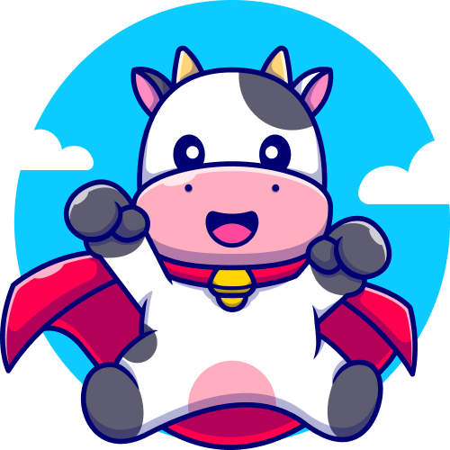

**CoWellness** is a mobile platform-based application to accommodate cattle farmers in monitoring the needs and health of cows. Monitoring related to the needs of cows is done with the cattle food dosing feature, as well as a reminder feature for feeding time. We provide an article feature that describes the types of diseases in cattle, as well as the characteristics of cattle infected with these diseases. In addition, as a preventive measure against the outbreak of cattle diseases, we created a Drop Point feature. The Drop Point feature is a feature that displays the nearest cow dung waste treatment center that can be reached by farmers. To further emphasize the convenience of farmers in the application we designed, we also added a discussion forum feature where farmers can interact with each other, so they can share information that can add new knowledge to them.
## Features

- Bovine food nutrition measures
- Feed and vitamin reminder
- Cow waste drop point
- Articles about cows
- Farmer discussion forum

## Tech Stack

**Flutter** - framework

**Firebase** - real-time data management and storage

**Figma** - UI and UX design

## Screenshots

* **Login & Register**

Login and Register are already connected to firebase and can also login using google login.
 
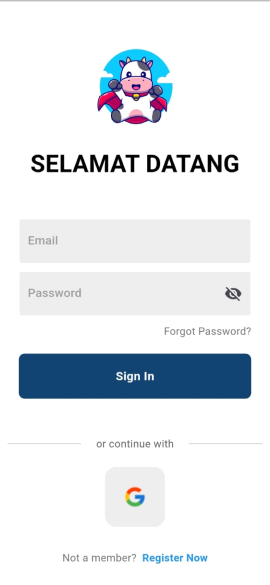
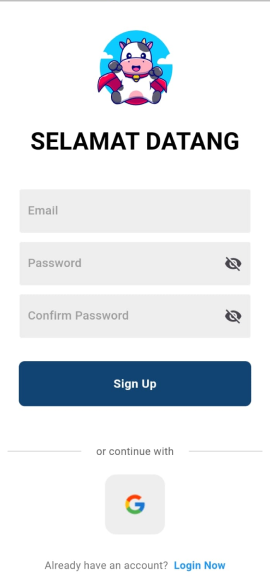
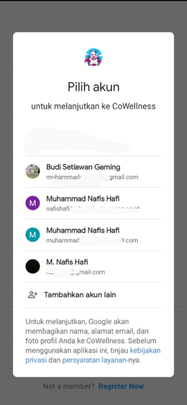

* **Nutrient dose**
  
We created the cow nutrition measure feature so that farmers can easily measure the nutrients and vitamins given to their cows.
 
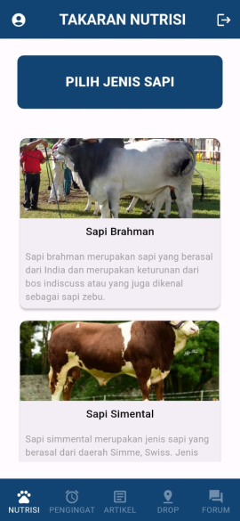
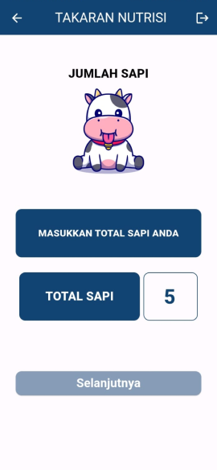
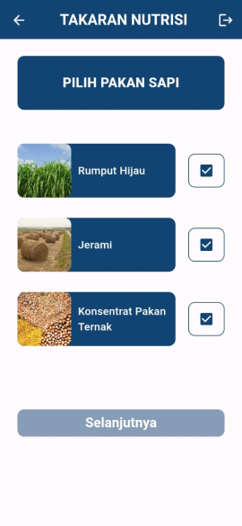
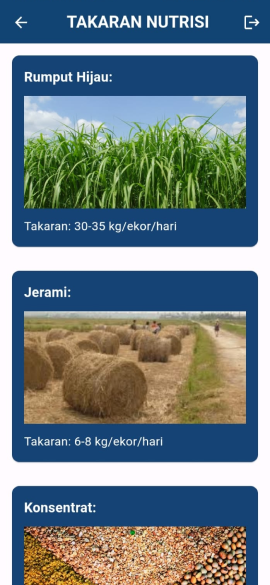

* **Articles**

Features articles that describe the types of diseases in cattle, as well as the characteristics of cattle infected with the disease and cattle health tips.
 
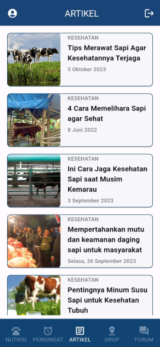
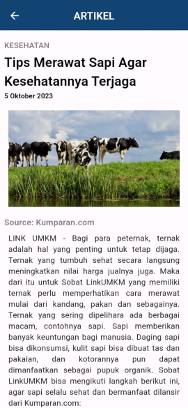

* **Forum**

The discussion forum is a place where farmers can interact with each other, so they can share information that can add new knowledge to them.
 
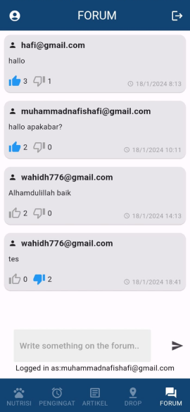

 

HACKFEST 2024 - CoDify Team

Hacker: Muhammad Nafis Hafi 
Hacker: Wahid Hidayat 
Hustler: Puan Bening Pastika 
Hipster: Muhammad Rizki Irawan Wijaya 
 
